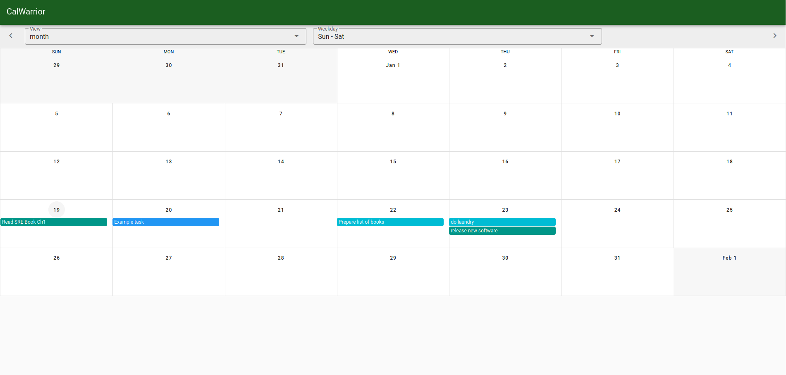

# calwarrior

Calendar view for [Taskwarrior](https://taskwarrior.org/)



## Why

Taskwarrior has a `Calendar` view in Terminal but it simply shows if any task is due on a particular date. I needed to visualise the list of tasks spread across a week, so I built a UI for it. I plan to keep it _really_ simple, which basically means that the UI is going to be **read only** and all edits must come through `task` CLI.

This works well for me and it was an overnight hack to scratch an itch!

## Usage

### Local Setup

```shell
$ task export > ~/calwarrior/data/tasks.json
$ yarn serve
```

### Docker

```shell
# We need to mount `tasks.json` fetched using `task export` inside container `/app/data`:
$ docker run -p 8000:80 -v `pwd`/data/tasks.json:/app/data/tasks.json:ro mrkaran/calwarrior:latest
```

[LICENSE](https://github.com/mr-karan/calwarrior/blob/master/LICENSE.md)
